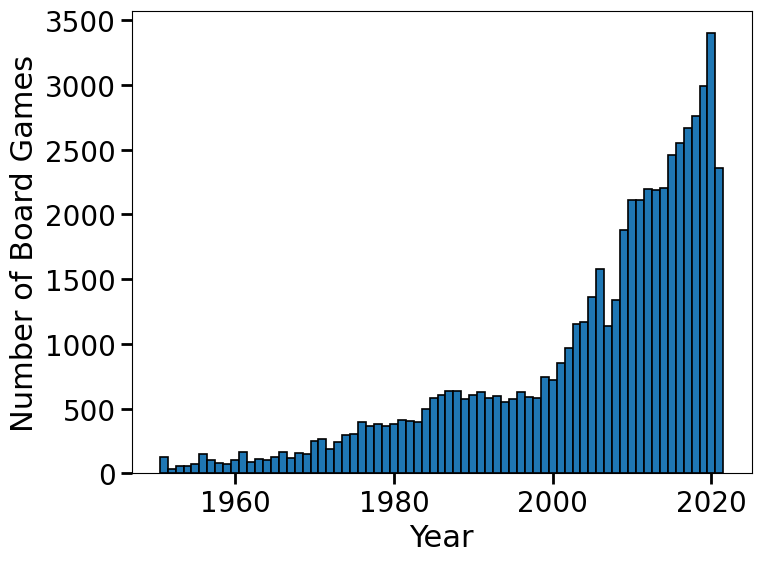

# Bored, or on Board?
## Focused feedback for board game developers.

Board games are a multi-billion dollar industry nowadays and the number of board games published each year has grown tremendously since the early 2000s

{:height="50%" width="50%"}

Games are no longer like Monopoly, a common family game that is notorious for long play times and ruining friendships. Nowadays, board games are vibrant, diverse, and unique experiences to be shared among friends and families. In a growing market, quick, directed feedback is needed to both improve the game's favoribility with its players, and ensure a high-quality product is published sooner in order to move onto the next big idea.

This github contains the files used to make the sentiment and categorization ML models and streamlit web app loading these models, available here: [Bored, or on Board?](http://bit.ly/boredboardsite). 

## Requirements
This program works on Anaconda Python v.3.7.3
> conda install --yes python==3.7.3

The following packages are also required

> pip install -r requirements.txt

## Data Scraping

Data scraping first needs to be done following the Board Game Scraper at: https://gitlab.com/recommend.games/board-game-scraper
by Markus Shepherd

> pip install board-game-scraper

This will return a JSON file (e.g., example.jl) containing user comments and board games. 

## Files 

chunk_files.sh: Break up example.jl into smaller JSON files 

plotting.py: Useful visuzalizations (comparing model performance, word feature importance, etc)

pseudolabel.py: Perform pseudolabeling of comments using keywords related to board game related categories

run_categorezation.py: Run binary classification of comment categorization using example.jl (or whatever JSON file you scraped)

run_sentiment.py: Run binary classification of comment sentiment using example.jl (or whatever JSON file you scraped)

run_streamlit.py: Run streamlit web app

utils.py: Various utiliy functions (saving & loading files)

wordprocess.py: Various NLP functions

